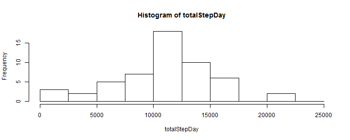
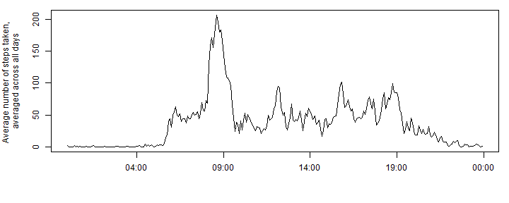
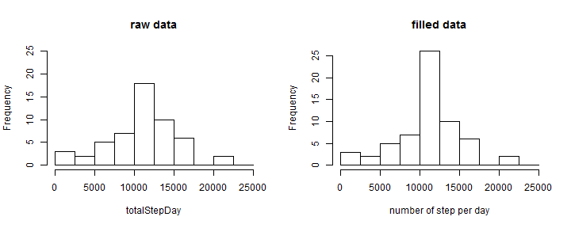
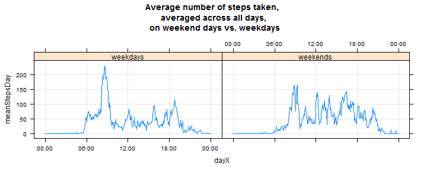

#Loading and preprocessing the data

```r
rawData<-read.csv("activity.csv",stringsAsFactors = F)
Data<-rawData[!is.na(rawData$steps),]
Data$date<-as.Date(Data$date)
```

#What is mean total number of steps taken per day?

###1. Calculate the total number of steps taken per day

```r
totalStepDay<-tapply(Data$steps,Data$date,sum)
```

###2. Make a histogram of the total number of steps taken each day

```r
hist(totalStepDay,breaks=seq(0,25000,by=2500))
```



###3. Calculate and report the mean and median of the total number of steps taken per day

```r
mean(totalStepDay)
```

```
## [1] 10766.19
```

```r
median(totalStepDay)
```

```
## [1] 10765
```

#What is the average daily activity pattern?

###1. Make a time series plot (i.e. type = "l") of the 5-minute interval (x-axis) and the average number of steps taken, averaged across all days (y-axis)

```r
dayX<-seq(from=as.POSIXct("2016-10-14 00:00:00"),by="5 min",length.out=12*24)
DaysList<-split(Data$steps,as.factor(Data$date))
meanStepsDay<-rep(0,length(dayX))
for(i in 1:length(meanStepsDay)){
    meanStepsDay[i]<-mean(sapply(DaysList,"[",i))
}
```

```r
par(mar=c(5,5,1,1))
plot(dayX,meanStepsDay,type="l",
     ylab="Average number of steps taken, \naveraged across all days",
     xlab="")
```



###2. Which 5-minute interval, on average across all the days in the dataset, contains the maximum number of steps?

```r
dayX[which.max(meanStepsDay)]
```

```
## [1] "2016-10-14 08:35:00 EDT"
```

#Imputing missing values

###1. Calculate and report the total number of missing values in the dataset (i.e. the total number of rows with 

```r
sum(is.na(rawData$steps))
```

```
## [1] 2304
```

###2.Devise a strategy for filling in all of the missing values in the dataset. The strategy does not need to be sophisticated. For example, you could use the mean/median for that day, or the mean for that 5-minute interval, etc.
###3. Create a new dataset that is equal to the original dataset but with the missing data filled in.


```r
#preallocate the new dataset called filledData
filledData<-data.frame(steps=rawData$steps,date=rawData$date)
#create datetime series in place of date
filledData$date<-strptime(paste(rawData$date,
                                sprintf("%04d",rawData$interval),sep=" "),format="%F %H%M")

idx<-which(is.na(filledData$steps))#indices of NA values
for (i in 1:length(idx)){
    #compute index of 5min interval in the average day
    iDay<-which(strftime(dayX,"%T") %in% strftime(filledData$date[idx[i]],"%T"))
    #fill the missing value with the average number of steps for the right time of the day
    filledData$steps[idx[i]]<-meanStepsDay[iDay]
}
```

###4. Make a histogram of the total number of steps taken each day and Calculate and report the mean and median total number of steps taken per day. Do these values differ from the estimates from the first part of the assignment? What is the impact of imputing missing data on the estimates of the total daily number of steps?

####Histogram

```r
totalStepDay2<-tapply(filledData$steps,as.Date(filledData$date),sum)
par(mfrow=c(1,2))
hist(totalStepDay,breaks=seq(0,25000,by=2500),main="raw data",ylim=c(0,25))
hist(totalStepDay2,breaks=seq(0,25000,by=2500),
     xlab="number of step per day",main="filled data")
```


Only central column raised in frequency because we filled NAs with mean values,
and mean value is between 1000 and 12500 steps.

####Median and mean

```r
library(xtable)
DF<-data.frame(rawData=c(mean(totalStepDay),median(totalStepDay)),
               filledData=c(mean(totalStepDay2),median(totalStepDay2)))
rownames(DF)<-c("mean","median")
xt<-xtable(DF)
print(xt,type="html")
```

<!-- html table generated in R 3.3.1 by xtable 1.8-2 package -->
<!-- Sun Oct 16 17:24:39 2016 -->
<table border=1>
<tr> <th>  </th> <th> rawData </th> <th> filledData </th>  </tr>
  <tr> <td align="right"> mean </td> <td align="right"> 10766.19 </td> <td align="right"> 10766.19 </td> </tr>
  <tr> <td align="right"> median </td> <td align="right"> 10765.00 </td> <td align="right"> 10766.19 </td> </tr>
   </table>
Impact on total number of steps per day is clearly very low

#Are there differences in activity patterns between weekdays and weekends?

###1.Create a new factor variable in the dataset with two levels - "weekday" and "weekend" indicating whether a given date is a weekday or weekend day.


```r
aWeek<-weekdays(seq.Date(from=as.Date("2016-10-10"),by="day",length.out=7))
filledData$week<-ifelse(weekdays(filledData$date) %in% aWeek[1:5],"weekday", "weekend")
```

###2.Make a panel plot containing a time series plot (i.e. type = "l") of the 5-minute interval (x-axis) and the average number of steps taken, averaged across all weekday days or weekend days (y-axis). See the README file in the GitHub repository to see an example of what this plot should look like using simulated data.


```r
library(lattice)
library(dplyr)
```

```
## 
## Attaching package: 'dplyr'
```

```
## The following objects are masked from 'package:stats':
## 
##     filter, lag
```

```
## The following objects are masked from 'package:base':
## 
##     intersect, setdiff, setequal, union
```

```r
splitWeekList<-split(select(filledData,steps,date),filledData$week)
weekDaysDF<-splitWeekList[[1]]
weekEndsDF<-splitWeekList[[2]]
## weekdays
DaysList<-split(weekDaysDF$steps,as.factor(as.Date(weekDaysDF$date)))
meanStepsWeekDays<-rep(0,length(dayX))
for(i in 1:length(meanStepsWeekDays)){
    meanStepsWeekDays[i]<-mean(sapply(DaysList,"[",i))
}

##weekends
DaysList<-split(weekEndsDF$steps,as.factor(as.Date(weekEndsDF$date)))
meanStepsWeekEnds<-rep(0,length(dayX))
for(i in 1:length(meanStepsWeekEnds)){
    meanStepsWeekEnds[i]<-mean(sapply(DaysList,"[",i))
}

##make data frame before plot
meanStepsWeek<-data.frame(dayX=rep(dayX,2),
                          meanStepsDay=c(meanStepsWeekDays,meanStepsWeekEnds),
                          weekday=as.factor(c(rep("weekdays",length(dayX)),
                                              rep("weekends",length(dayX)))))
AT <- pretty(dayX)
xyplot(meanStepsDay ~ dayX | weekday,data=meanStepsWeek,
       grid=T,type=c("l"),
       main="Average number of steps taken, \naveraged across all days,\n on weekend days vs. weekdays",
       # xlab="",ylab=list("Puissance (W)", cex=1.5),
       # ylim=c(0,max(subGTab$Prod)),
       scales=list(x=list(at=AT,labels = format(AT, "%H:%M")))
       # par.strip.text=list(cex=2))
)
```




